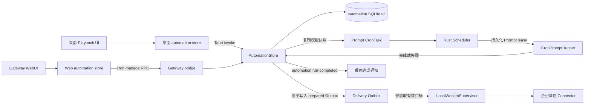

# Playbook 与自动投递

Playbook 是可复用的 Auto Prompt 模板。它把提示词、模型、推理等级、工作目录、Skills、系统工具、MCP 服务器和结果投递策略保存为一组配置；用户再为同一个 Playbook 创建一个或多个 Cron 任务。

核心语义是“创建时复制”，不是“运行时引用”：从 Playbook 创建 CronTask 时，后端把模板当前值复制到新任务。之后编辑或删除 Playbook，不会修改已经生成的任务。这使每个定时任务的执行权限和投递目标都能独立审计，也避免模板变更静默扩大既有任务权限。

## 用户流程

1. 在桌面端“定时任务 -> 工作流模板”或 Gateway WebUI 的 Playbooks 页面新建模板。
2. 填写名称、提示词和必选模型；按需固定推理等级、工作目录、Skills、系统工具和 MCP 服务器。
3. 如需自动投递，启用企业微信投递，填写目标会话 ID，并选择“始终”“仅成功”或“仅失败”。
4. 保存 Playbook。前端通过带 revision 的操作提交创建或修改，后端校验后写入 automation SQLite。
5. 点击“创建定时任务”，填写六段 Cron 表达式、任务名称、是否启用、执行次数和 1-600 秒超时。
6. 后端读取 Playbook 当前版本，把配置复制为一个新的 `type: "prompt"` CronTask；同一个 Playbook 可以重复创建多个不同频率的任务。
7. 调度器触发任务，Prompt Runner 使用任务携带的模型和能力快照执行。运行记录保存结果；满足 `onlyOn` 时，由桌面端本地企业微信运行时投递 Markdown 摘要。
8. 桌面端在运行和投递都到达最终状态后显示完成通知；完整记录可从 Cron 运行历史查看。

## 架构与数据流



| 层 | 主要职责 |
|---|---|
| 桌面前端 | Playbook 列表、编辑器、能力选择、创建计划；通过 Tauri command 读写桌面权威状态；监听 Playbook/Cron 变更和运行完成事件。 |
| Gateway WebUI | 提供与桌面端对应的 Playbook 页面；通过已认证的 Gateway WebSocket `cron.manage` 转发操作，不在浏览器中执行任务或持有企业微信凭据。 |
| 前端 automation store | 只接受后端权威快照；分别维护 Cron、Hooks、Playbooks revision；冲突时用响应快照重放当前操作。 |
| Rust `AutomationStore` | 校验字段、执行 SQLite 事务、比较 revision、创建 CronTask、持久化 Prompt lease 和运行记录，并发布状态事件。 |
| Rust Scheduler | 加载可运行任务、处理并发和超时、把 Prompt 请求交给前端 Runner；运行完成后评估投递条件。 |
| `CronPromptRunner` | 根据 PromptRunRequest 中的能力快照构建运行时工具集合，调用固定的 provider/model，并回传成功状态和最终输出。 |
| `LocalWecomSupervisor` | 使用本地已认证 Connector 向固定 `targetId` 发送 Markdown，等待确认，并把发送结果写回运行记录。 |

桌面端是 automation 数据和实际执行的权威节点。Gateway WebUI 只是远程管理入口：`playbooks_apply` 和 `playbook_create_cron` 经 Gateway bridge 落到同一个 `AutomationStore`，Playbook 快照则通过设置同步返回 WebUI。

## 数据与接口契约

### Playbook

```ts
type Playbook = {
  id: string;
  name: string;
  description: string;
  prompt: string;
  selectedModel: {
    customProviderId: string;
    model: string;
  };
  reasoning?: "off" | "minimal" | "low" | "medium" | "high" | "xhigh" | "max";
  workdir?: string;
  selectedSkills?: string[];
  selectedSystemTools?: string[];
  mcpServerIds?: string[];
  delivery?: {
    channel: "wecom";
    targetId: string;
    onlyOn: "always" | "success" | "failure";
  };
  createdAt: number;
  updatedAt: number;
};
```

| 字段 | 规则 |
|---|---|
| `id` | 服务端在创建操作缺少 ID 时生成 UUID；响应和后续更新中必有。 |
| `name` / `prompt` | 去除首尾空白后必须非空。 |
| `description` | 可选展示文本，缺失按空字符串处理。 |
| `selectedModel` | 必填，provider ID 和 model 均必须非空。只保存引用，不复制 provider URL、API key 或自定义 headers。 |
| `reasoning` | 可选；缺失或空值使用运行时默认推理等级。 |
| `workdir` | 可选；非空时固定目录，缺失时沿用触发时的全局工作目录。新建表单默认带入当前工作目录。 |
| 三组能力字段 | 可选字符串数组；后端去空白、去空项并去重。缺失与显式空数组有不同兼容语义，见下文。 |
| `delivery` | 可选；当前仅接受 `channel: "wecom"`，启用时 `targetId` 必须非空，`onlyOn` 缺失时默认 `always`。 |
| `createdAt` / `updatedAt` | 由后端写入毫秒时间戳；更新不能改写 `id` 和 `createdAt`。 |

Playbook 存在 `automation_playbooks` 表中，结构字段存列，执行配置存 `config_json`。独立的 `playbooks_revision` 存在 `automation_meta`；automation schema 版本为 2。

### CRUD 与实例化

| 场景 | 桌面命令 | Gateway action | 关键输入 |
|---|---|---|---|
| Playbook 创建、更新、删除、排序 | `automation_playbooks_apply` | `playbooks_apply` | `{ baseRevision, ops }` |
| 从 Playbook 创建 CronTask | `automation_playbook_create_cron` | `playbook_create_cron` | `{ playbookId, cronBaseRevision, cron, ... }` |

`ops` 沿用 automation 的操作契约：`create { item }`、`update { id, patch }`、`delete { id }`、`reorder { ids }`。批量操作在同一个 SQLite immediate transaction 中执行，任一操作失败则整批不提交。

实例化输入如下：

```ts
type CreatePlaybookCronInput = {
  playbookId: string;
  cronBaseRevision: number;
  cron: string;
  name?: string;
  description?: string;
  enabled?: boolean;             // 默认 true
  remainingExecutions?: number;  // 缺失表示不限次数
  timeoutSeconds?: number;       // 默认 300，范围 1-600
};
```

后端以 `playbookId` 读取事务内当前已提交的模板，生成新 UUID，并复制 `prompt`、`selectedModel`、`reasoning`、`workdir`、三组能力快照和 `delivery`。创建输入只覆盖计划自身的名称、描述、Cron、启用状态、剩余次数和超时。Cron 表达式使用“秒 分 时 日 月 周”六段格式。

### 运行与投递字段

`CronRunRecord` 在原有运行信息之外增加：

```ts
type DeliveryStatus = "pending" | "sent" | "skipped" | "failed" | "unknown";

type CronRunRecord = {
  // 原有运行字段省略
  deliveryStatus?: DeliveryStatus;
  deliveryError?: string;
};
```

`deliveryStatus` 缺失表示该任务没有投递配置。运行记录上的 `pending` 表示投递 Outbox 尚未收敛到终态；`unknown` 表示发送调用已经进入进行中，但结果无法确认。`deliveryError` 只保存经过归一化、截断的安全错误，而不是 Connector 原始错误。

企业微信投递另外有一张 durable Outbox 表，状态机为：

```text
prepared -> sending -> sent
   ^          |  \-> failed
   |          \----> unknown
   +-- 仅发送前失败
```

`prepared` 行与运行终态在同一个 SQLite 事务中创建，并使用 `automation:<executionId>:delivery:v1` 幂等键。领取时会再次检查目标 `enabled=true` 且 `validationStatus="valid"`，然后以短事务把行变为 `sending` 并写入 lease。只有当前 `sending` 行能被标记为 `sent`、`failed` 或 `unknown`；终态不可被覆盖。

## 能力快照与向后兼容

Playbook 创建 CronTask 时复制的是能力 ID 列表，不是 Skill 文件、工具实现、MCP 配置或凭据。运行时仍以当前安装和启用状态为基础，再用快照收窄可见能力。因此快照是权限上限，不会让已删除、已停用或不支持 Cron scope 的能力重新可用。

| 任务字段状态 | 运行语义 |
|---|---|
| 字段缺失或 `undefined` | 兼容 Playbook 上线前的旧 CronTask，继承当前全局对应配置。 |
| 显式 `[]` | 禁用整组能力；不得回退到全局选择。 |
| 非空数组 | 只允许数组指定且当前运行时仍有效的能力；未知系统工具会被规范化过滤，MCP 也必须仍存在于当前配置。 |

三组字段分别独立解释，不能因为其中一组缺失而重置其他组。前端新建 Playbook 时默认快照当前已选 Skills、当前系统工具，以及 `settings.mcp.servers` 中所有 enabled server ID；用户可以显式清空任意一组。

Prompt 入队时，CronTask 上的三组字段会继续复制到持久化 `PromptRunRequest`，防止排队后全局配置变化扩大该次运行的权限。旧的请求行没有这些字段时，Runner 才按旧行为回退全局配置。

模型和工作目录也遵循固定引用原则：

- `selectedModel` 固定 provider ID 与 model 名称，但 provider 凭据和网络配置运行时读取当前设置；provider 被删除或 API key 不可用会令运行失败。
- 非空 `workdir` 是任务固定目录。目录在触发时不存在会令本次运行失败，并禁用任务，避免反复在错误目录执行。
- 未固定 `workdir` 的任务在排队时解析当前全局目录，并把解析结果写入请求；更早版本的请求行为空时才在 Runner 中回退当前全局目录。

## Revision 与冲突处理

Cron、Hooks 和 Playbooks 各自维护独立 revision，避免无关域的写入互相冲突。

- Playbook CRUD 使用 `baseRevision` 对比 `playbooks_revision`。
- 从 Playbook 创建任务使用明确命名的 `cronBaseRevision` 对比 `cron_revision`，因为该操作修改的是 Cron 列表。
- revision 不一致时后端不执行操作，返回 `status: "conflict"` 和最新权威快照。
- 桌面端与 WebUI store 先接收最新快照，再用新的 revision 重放同一组字段级操作，最多尝试 3 次。
- 连续 3 次冲突后抛出 `AutomationConflictError`，由 UI 展示错误；MVP 不提供逐字段人工合并界面。
- 前端忽略 revision 更低的迟到快照，避免 Gateway 同步或事件乱序使本地视图倒退。

实例化端点只锁定 Cron revision。它在事务内按 `playbookId` 读取当时最新模板，所以在计划弹窗打开后若模板被其他客户端修改，新任务会复制后端提交时看到的最新模板，而不是弹窗打开时的旧对象。

## 企业微信安全边界

自动投递必须满足以下边界：

- `channel` 由后端白名单限制为 `wecom`，当前不接受任意 URL、Webhook 或模型生成的通道名称。
- `targetId` 在用户创建或编辑 Playbook 时写入，并在实例化时复制到 CronTask 和 PromptRunRequest。运行中的模型输出不能覆盖收件人，也不会作为投递路由参数解析。
- Gateway WebUI 只能通过已认证的 `cron.manage` 修改配置；浏览器不直接连接企业微信，也不持有 Connector 认证信息。
- 实际发送只发生在桌面进程的 `LocalWecomSupervisor`，复用已启动且已认证的本地 Connector。Playbook 不保存企业微信 token 或 secret。
- 出站消息只使用 Markdown 发送协议。会话 ID 会去首尾空白、限制为 256 个字符并拒绝控制字符；本地发送队列有限，发送确认超时为 10 秒。
- 投递正文由 ArcForge 组装，包含任务名称、成功/失败、耗时、任务 ID 和最终输出。输出会移除 ANSI 转义序列及 Connector 禁止的控制字符，再按 UTF-8 安全边界截断到约 8 KiB；整条消息上限约 12 KiB，运行库中的输出另有 50,000 字符上限。
- 运行结果本身可能包含业务数据或工具输出。目标会话应由有权限的操作者配置，并遵循最小披露原则；不要依赖长度截断来脱敏秘密。

`targetId` 是路由标识，不应当被当作秘密。它会随 Playbook/Cron 权威快照供已授权的桌面端和 Gateway WebUI 展示。企业微信认证材料不进入这些快照。

## `onlyOn`、状态与失败策略

`onlyOn` 只根据任务的 `success` 布尔值判断，不根据投递结果反向修改任务成败：

| `onlyOn` | 运行成功 | 运行失败或过期 |
|---|---|---|
| `always` | 投递 | 投递 |
| `success` | 投递 | `skipped` |
| `failure` | `skipped` | 投递 |

状态流转如下：

| 状态 | 含义与后续行为 |
|---|---|
| 未设置 | 任务没有 `delivery`，运行完成后直接发送桌面完成事件。 |
| `pending` | 运行结果已持久化且条件匹配，Outbox 仍为 `prepared` 或 `sending`；这是中间状态。 |
| `skipped` | 任务有投递配置，但 `onlyOn` 与运行结果不匹配；不会调用 Connector。 |
| `sent` | Connector 已确认发送成功。 |
| `failed` | 发送前已确认请求本身不可恢复（例如通道或目标参数非法）；`deliveryError` 保存稳定的安全错误摘要。 |
| `unknown` | 已进入发送阶段但结果无法确认，例如发送后断连或进程退出；系统不会自动重发。 |

当需要发送时，后端在同一个 SQLite 事务中写入运行记录和 `prepared` Outbox，然后领取并调用 Connector。发送结果通过绑定 `executionId` 的条件更新同时收敛 Outbox 与运行记录；状态落盘遇到暂时性错误会有限重试，但只更新本地状态，不会再次调用 Connector。`automation:run-completed` 在无投递、`skipped`，或投递进入 `sent/failed/unknown` 后只发布最终状态，避免桌面端先显示 pending、随后重复提醒。桌面通知把“运行失败”和“投递失败/未知”都视为需要注意，但运行历史仍分别保留两类结果。

每次 Outbox 领取只发起一次 Connector 调用。若调用前即可确认尚未触达企业微信（例如 Connector 未运行、未认证、输入通道尚不可用或本地队列已满），Outbox 会安全回到 `prepared`，由后续扫描再次领取；运行记录在此期间保持 `pending`。请求本身非法等不可恢复的前置错误写为 `failed`；超时、发送后连接中断等结果未知的错误写为 `unknown`，绝不自动重发。系统没有人工“重新投递”操作；SQLite 状态更新本身最多重试 3 次、每次间隔 250ms，这些状态更新不会调用 Connector。系统仍不承诺 exactly-once。

## 超时与重启恢复

Prompt 运行先以 `pending`/`leased` 状态和 lease 截止时间持久化，默认 lease 与任务 `timeoutSeconds` 一致。

- lease 超时：记录转为 `expired`、`success: false`，通知前端中止仍在执行的 Prompt；`always` 或 `failure` 仍会生成失败投递。
- 应用重启：启动时先把上次进程遗留的 `pending`/`leased` Prompt 标为 `expired`，记录“被重启中断”，并按失败结果执行同样的 `onlyOn` 策略；随后把仍处于 `sending` 的 Outbox 隔离为 `unknown`。
- 任务有有限执行次数时，已入队且最终超时/中断的计数仍会扣减，避免重启导致计划执行次数无限回补。
- 固定工作目录丢失、Prompt 入队失败或 Runner 返回失败时，也按失败结果评估投递；运行错误不会被投递失败覆盖。

恢复边界需要特别注意：`prepared` 表示尚未调用供应商发送 API，启动时会重新扫描并安全领取；`sending` 表示调用可能已经发生，启动时会收敛为 `unknown`，并把对应运行记录从 `pending` 收敛为 `unknown`，只发布一次最终完成事件。系统不会自动重发 `unknown`，因为 Connector 可能已经接收消息但确认尚未落库；这条路径同样无法提供 exactly-once 保证。目标在排队后变为 disabled 或 pending/invalid 时不会被领取，重新验证目标后才可继续处理。

## MVP 边界

- Playbook 当前只实例化为 Prompt CronTask，不包含 Bash、HTTP 或多步骤 DAG 编排。
- Playbook 与 CronTask 没有持续关联、版本号或批量升级机制；模板变更不会传播到既有任务。
- 自动投递仅支持企业微信 Markdown 和一个固定目标，不支持多收件人、附件、消息模板、Webhook、邮件或其他 IM。
- 没有对已开始的外部发送做自动重试，也没有死信队列、送达查询或人工重新投递按钮。Outbox 使用幂等键；仅能证明尚未调用供应商 API 的 `prepared` 前置失败会重试，`unknown` 永不自动重发。
- Gateway WebUI 可管理和查看快照，但执行、Prompt lease、企业微信发送和桌面完成通知都依赖桌面进程运行。
- 能力快照只保存 ID，不打包 Skill/MCP 内容或 provider 配置；外部资源变化仍可能使未来运行失败。
- 并发 Prompt 尚未完成时再次触发会记录跳过；该合成跳过记录不走 Playbook 自动投递链路。
- 运行历史按任务最多保留 200 条，并清理 30 天前的完成/过期记录，不是长期审计仓库。
- 完成通知当前是桌面进程内 toast，不是操作系统级可靠通知，也不会在 WebUI 镜像展示。

## 测试建议

### Rust 单元与集成测试

- Schema v1 -> v2 幂等升级：创建 `automation_playbooks`，为 runs 增加 `delivery_status`/`delivery_error`，保留旧任务和旧运行记录。
- Playbook create/update/delete/reorder：时间戳和 ID 规则、模型必填、reasoning 枚举、数组规范化、非法 channel/空 `targetId` 回滚整批事务。
- Playbook 与 Cron 使用独立 revision；冲突响应返回最新快照且不产生部分写入。
- 实例化复制全部字段，生成唯一任务 ID；修改/删除 Playbook 后既有 CronTask 保持不变。
- `cronBaseRevision` 冲突、Playbook 不存在、六段 Cron 非法、执行次数和 1-600 秒超时边界。
- `onlyOn` 九宫格：三个策略分别覆盖成功、失败、过期；检查 `pending/skipped/sent/failed/unknown`、Outbox 状态和 `deliveryError`。
- Connector 未运行、未认证、超时、队列满与成功确认；验证安全错误不泄漏底层细节、消息按 UTF-8 边界截断。
- Prompt 正常完成、lease 超时和重启恢复都能触发 failure/always 投递，并且最终只发一次 `automation:run-completed`。
- `update_run_delivery` 只允许绑定的 `sending` Outbox 把运行记录从 `pending` 转为最终状态，重复回调不能重复通知；重启后 `prepared` 可恢复、`sending` 进入 `unknown`。

### 前端契约测试

- 桌面端和 WebUI 的 Playbook 类型、默认值、字段名和 i18n key 保持镜像，尤其是必填 `selectedModel` 与 `cronBaseRevision`。
- 表单启用投递时强制目标非空；关闭投递以 `null` 明确清除旧值。
- 默认 MCP 快照来自 enabled server ID，不使用不能控制实际执行的展示选择。
- 缺失能力字段继承全局，显式空数组禁用能力，非空数组不会被全局配置扩大。
- store 在冲突后采用响应 revision 重试，最多 3 次；迟到的低 revision 快照不覆盖新状态。
- 旧桌面端返回不含 `playbooks` 的 Gateway 设置快照时，WebUI 回退为 `{ revision: 0, items: [] }`。
- 桌面完成通知只在最终状态展示一次，投递失败显示安全错误，长任务名和输出在桌面及窄屏下不溢出。

### 端到端验收

1. 在桌面创建一个仅允许少量工具、固定工作目录、仅失败投递的 Playbook，从桌面和 WebUI 分别创建任务，确认生成任务快照一致。
2. 创建任务后修改模板能力和目标，确认旧任务仍使用旧快照，新任务使用新快照。
3. 覆盖成功、模型错误、目录丢失、Prompt 超时和应用重启场景，核对运行状态、投递状态、企业微信正文和桌面通知。
4. 两个客户端同时编辑 Playbook/创建计划，验证 revision 冲突重放不会丢失无关字段，也不会创建重复任务。
5. 在企业微信 Connector 停止和恢复时运行任务，确认投递先保持 `pending`、恢复后从 `prepared` 安全发出，且任务 `success` 不受影响；再模拟发送后断连，确认 `unknown` 不会自动补发。
